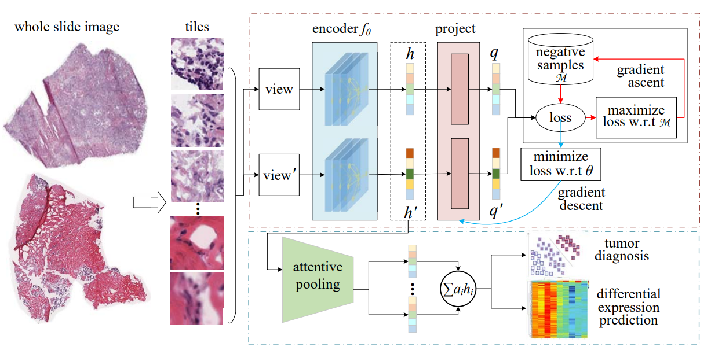

# HistCode
Source code and data for 
"Contrastive learning-based computational histopathology predict differential expression of cancer driver genes"

HistCode is a multi-stage model. 
Firstly, [adversarial contrastive learning](https://arxiv.org/abs/2011.08435) is used to unsupervised extract tile-level features, 
then the attention-pooling is used to aggregate tile-level features into slide-level features, 
and finally it is used in the downstream tumor diagnosis and differential gene expression prediction tasks.

# Now Updating

## Seg and Tile
You can download your own wsi dataset to the directory slides, 
then run data_processing/create_patches_fp.py to seg and tile wsis, 
adjust the parameters according to your needs

## Train Contrast Learning Model
Run train/train_adco.py to train contrast learning model on tiles, 
you should write Adco/ops/argparser.py to configure the data source 
and the save address and ADCO related parameters firstly. 
In addition, you need to prepare a CSV file similar to dataset_csv/sample_data.csv, 
this file needs to save the name of the WSI file used for training.

## extract tile-level features
Run data_processing/extract_features_fp.py to extract the tile-level features.
You should add the following parameters When running.
- data_h5_dir: directory for storing tile results, default tile_results.
- data_slide_dir: directory for storing WSIs, default slides/TCGA-LUNG.
- csv_path: the csv file that saves the name of the WSI files used for training, like dataset_csv/sample_data.csv.
- feat_dir: directory for storing tile-level features, default features.
- model_type: the model you used for extract tile-level features, default ADCO.
- data_type: data source name, default tcga_lung.
- model_path: weight path, default models/cl_10_tcga_lung_not_sym_200.pth.tar

